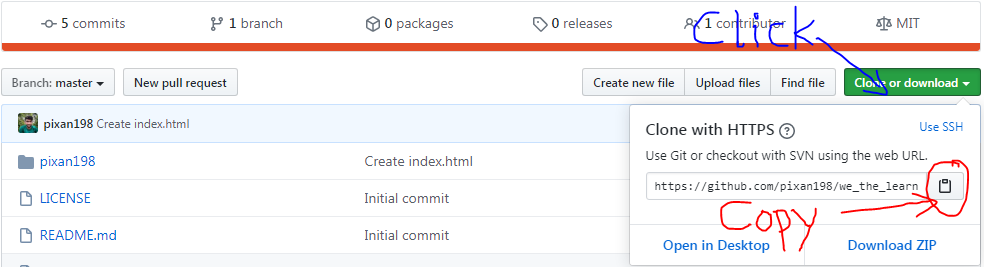
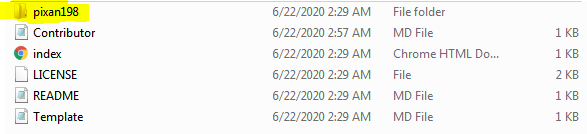
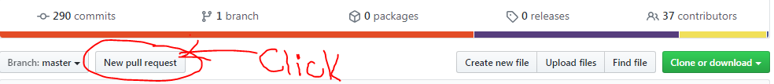
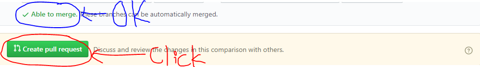
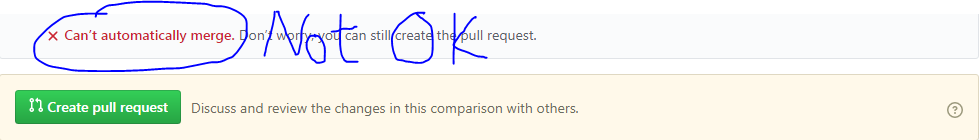

# Steps to contribute to this repository

> 1. Fork and clone this repository
> 
> 

**To clone the repo, open cmd(at desired location) or Git Bash Terminal and type following command**

```git
git clone https://github.com/pixan198/we_the_learner.git
```
> 2. In your local clone, create a folder with same name as your GitHub username.
> 
> 

> 3. Inside this folder create a `README.md` file
>       - `.md` extension is for `Markdown` file.
>       - Copy text from [Template.md](https://github.com/pixan198/we_the_learner/blob/master/Template.md) file and paste it in your `README.md` file and then make changes as instructed.

> 4. Save and Commit your changes and it to your forked GitHub Repo.

> 5. Make a Pull Request to `pixan/we_the_learner` and give appropriate title to it.
> 
> 
>    - If you've followed the steps carefully, you'll see the message `Able to merge` like below
> 
>       
>    - If you tried changing code of other files or your repo is not up to date with `we_the_learner` then you may see something like following
> 
>       
> 
>    - No need to worry, make a pull request and comment on it or you can ask us on discord.

> 6. `Congratulations!`, You have successfully contributed to `we_the_learner` and I hope you have learned something.
